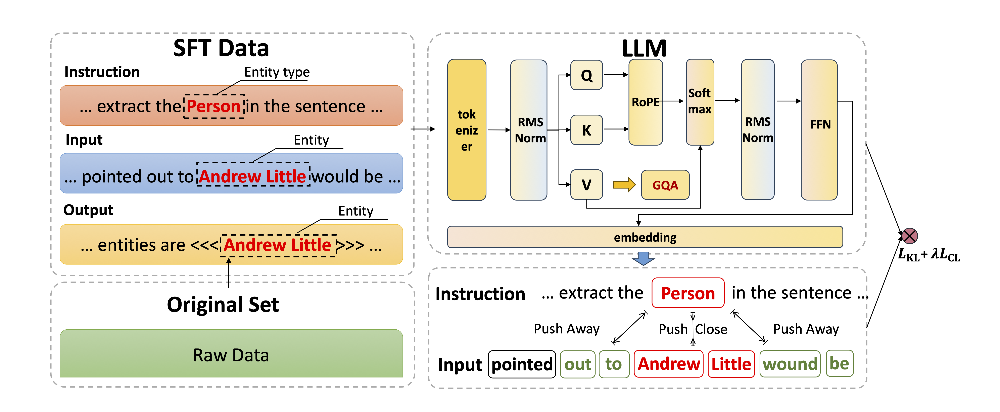

# CLLMFS

[](https://zenodo.org/doi/10.5281/zenodo.13363900)

Accepted by [27TH EUROPEAN CONFERENCE ON ARTIFICIAL INTELLIGENCE](https://www.ecai2024.eu)

PyTorch implementation for [CLLMFS](https://github.com/yuzilan/CLLMFS) [[paper]](https://github.com/yuzilan/CLLMFS/blob/main/CLLMFS.pdf)

## Overview

Few-shot Named Entity Recognition (NER), the task of identifying named entities with only a limited amount of labeled data, has gained increasing significance in natural language processing. While existing methodologies have shown some effectiveness, such as enriching label semantics through various prompting modes or employing metric learning techniques, their performance exhibits limited robustness across diverse domains due to the lack of rich knowledge in their pre-trained models. To address this issue, we propose **CLLMFS**, a Contrastive Learning enhanced Large Language Model (LLM) Framework for Few-Shot Named Entity Recognition, achieving promising results with limited training data. Considering the impact of LLM's internal representations on downstream tasks, CLLMFS integrates Low-Rank Adaptation (LoRA) and contrastive learning mechanisms specifically tailored for few-shot NER. By enhancing the model's internal representations, CLLMFS effectively improves both entity boundary awareness ability and entity recognition accuracy.



## Environment Requirement

## Code

Our code will be released in the near future.

# Citation

Please cite [our paper](https://arxiv.org/) if you use this code in your own work:

```

```


